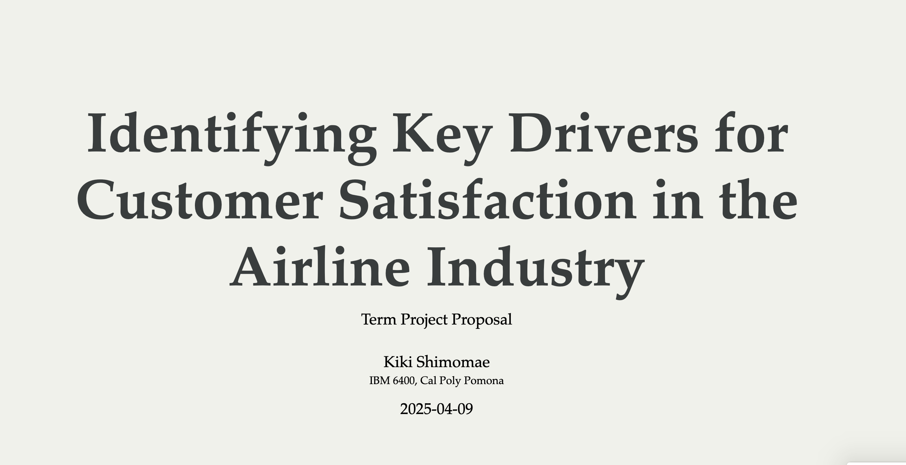

This section includes some assignments I completed for IBM 6400 where I learned about various tools & techniques using R and Quarto.

## [1. Dashboard](dashboard.qmd)

An interactive dashboard project using R and Quarto.

## [2. Essay on Shiny Apps](ShinyApps.qmd)

A reflective essay on the development and utility of Shiny Apps.

## [3. Essay on Shiny Live](ShinyLive.qmd)

A brief essay on using Shiny Live for real-time web applications.

## [4. Client Consulting Project for United Airline](presentation1.qmd)

-   Investigate what impact the most for customer satisfaction for airline industry.
