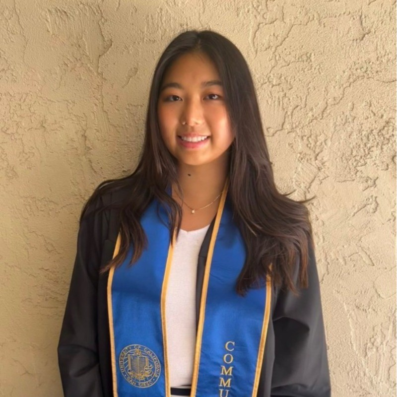

::::: columns
::: {.column width="30%"}
{width="100%" style="border-radius: 50%;"}
:::

::: {.column width="70%" style="padding-left: 3rem;"}
I'm pursuing **Master's in Digital Marketing** at Cal Poly Pomona with experience in **social media management**, **data analysis**, and **SEO**. I'm passionate about blending data analysis into creative work for better business strategy and execution. My career aspiration is to be a bridge to **connect people globally**.
:::
:::::

## Education

**Master of Science in Digital Marketing** \| Cal Poly Pomona (Pomona, CA), 2023 - 2025

**Bachelor of Arts in Communication** \| UC San Diego (La Jolla, CA), 2020 - 2022

## Skills

Social Media Management (Instagram, TikTok, YouTube, LinkedIn), Graphic Design (Canva), Video & Audio Editing (Adobe premiere pro, iMovie), R (Programming), Fluent in Japanese and English

## Let's Connect

You can [email me](kikishimomae7@gmail.com) or connect on [LinkedIn](https://www.linkedin.com/in/kikishimomae/).
