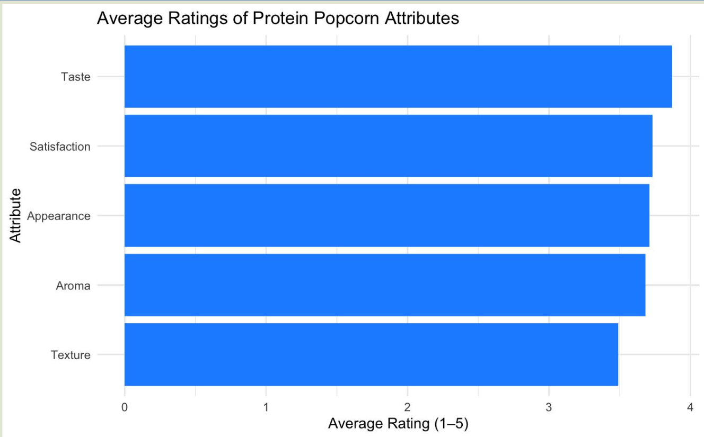
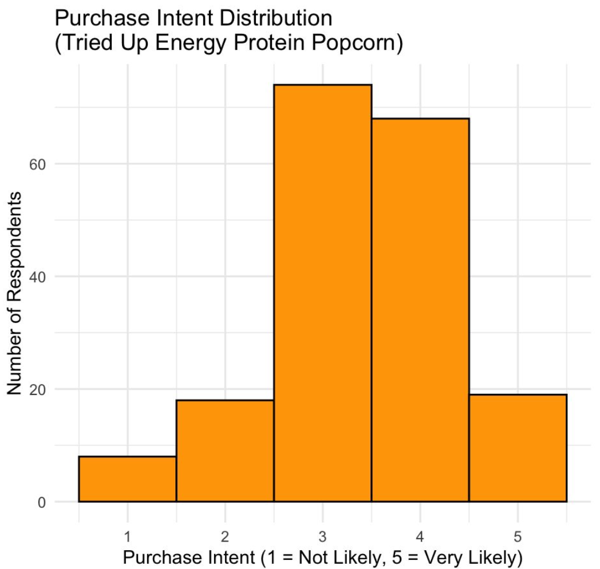

This page showcases my hands-on experience using data analytics, visualization and strategic insight to solve real-world marketing & business problems.

# 1. Customer Satisfaction Analysis for United Airline

Culminating (Graduate thesis) project focused on data-driven customer segmentation, satisfaction analysis, and actionable marketing recommendations for United Airlines using secondary data from real anonymized airline company.

-   🎯 Focus: Airline passenger satisfaction, inflight service quality, and customer segmentation\
-   📊 Tools used: R and Excel
-   Methodology: Logistic regression, decision tree, random forest, descriptive analysis.
-   📈 Outcome: Identified top drivers of customer satisfaction and proposed tailored service improvements & actionable marketing recommendation.
-   Visualization: Dashboard for Inflight Service Quality

Below is an embedded preview of the dashboard created for the United Airlines project:

<iframe src="dashboard.html" width="100%" height="600px" frameborder="0">

</iframe>

[Open Full Dashboard](dashboard.html)

# 2. Branding Strategy for Up ENERGY PROTEIN POPCORN  

Up ENERGY Popcorn is a unique snack product that combines traditional popcorn with a caffeine boost—derived from green tea extract or coffee beans—to serve as a convenient alternative to coffee or energy drinks.

-   🎯 Focus: Help a functional snack brand grow sales by improving brand awareness, attracting new customers, and building community.
-   📊 Tools used: R, GenAI
-   🔬 Methodology: Survey design, Descriptive Analysis, T-test, ANOVA, Regression
-   📈 Outcome: Identified key drivers of purchase intent and awareness. Delivered clear, data-backed recommendations to enhance digital campaigns and brand messaging.
-   📊 Visualization: Figures below are sample analysis visual from the Up Energy Popcorn project

{fig-align="right" width="50%"}{fig-align="left" width="50%"}
